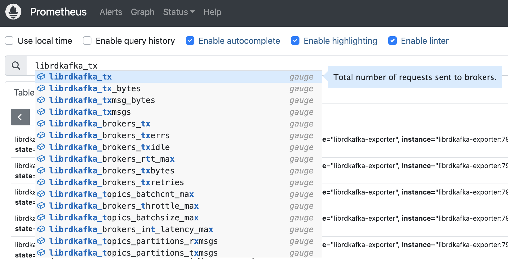
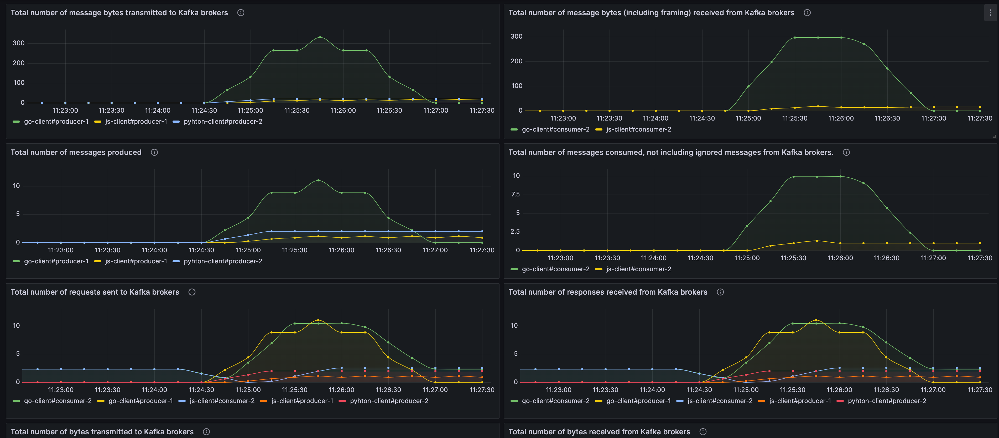

# Librdkafka Stats Prometheus exporter

This is a simple prometheus exporter for `librdkafka` Stats. It provides a common implementation for all the `librkafka` clients, instead of providing a specific exporter+server implementation for each language.

It uses the [librdkafka](https://github.com/confluentinc/librdkafka/blob/master/STATISTICS.md) definition to expose the stats as Prometheus metrics. Any librdkafka client can push stats (json) to the server using the `statistics.interval.ms` configuration and the `stats_cb`. The server will parse the stats JSON requests and expose those stats as Prometheus metrics.



*This is a experimental implementation. See Project Status at the end of this doc.*

- **Endpoints**
  
  - `/` - POST - The client will POST JSON Stats from `librdkafka`
  - `/metrics` - GET - Get stats in Prometheus format. (Prometheus target)

- **Prefix**: All the metrics are translated using the prefix `librdkafka_`
  
- **Labels**, for all the metrics: `client_id`, `name` and `type`
  
  - Brokers:
    - Prefix: `librdkafka_brokers_`
    - Labels: `broker, nodeid, nodename, source, state`
  - Topics:
    - Prefix: `librdkafka_topics_` 
    - Labels: `topic`
  - Consumer Groups:
    - Prefix: `librdkafka_consumergroups_`
    - Labels: `state, join_state, rebalance_reason`
  - EOS:
    - Prefix: `librdkafka_eos_` 
    - Labels: `idemp_state, txn_state`

## Usage

## Prometheus

Prometheus configuration:

```yml
  - job_name: "librdkafka-exporter"
    static_configs:
      - targets:
          - "librdkafka-exporter:7979"  
    relabel_configs:
      - source_labels: [__address__]
        target_label: hostname
        regex: '([^:]+)(:[0-9]+)?'
        replacement: '${1}'
```

## Example stack

`examples` directory: 

Docker Compose (`docker-compose.yaml`):

- Kafka Broker (29092)
- Prometheus (9090)
- Grafana (3000)
- Kafka Clients (Go, JS, Pyhton)

Build:

```bash
docker-compose build 
```

Run:

```bash
docker-compose up -d
```

### Clients

All clients are configured using  `statistics.interval.ms`

## Grafana

`http://localhost:3000` (admin/password)

### Dashbaords

`./examples/grafana/provisioning/dashboards/librdkafka.json`



#### Golang

Dir: `./clients/go`

Produce 1000 messages and consume them.
There is a 500ms gap between each message production.

Environment variables:

- `TOPIC: test-topic-go` produce and consume.  
- `STATS_EXPORTER_URL`: http://librdkafka-exporter:7979
- `BOOTSTRAP_SERVERS: broker:29092`

Logs:

```bash
docker-compose logs go-client
```

#### JavaScript

Dir: `./clients/js`

Produce 1000 messages and consume them. There is a 500ms gap between each message production.

Environment variables:

- `TOPIC: test-topic-js` produce and consume.  
- `STATS_EXPORTER_URL`: http://librdkafka-exporter:7979 
- `BOOTSTRAP_SERVERS: broker:29092`

Logs: 

```bash
docker-compose logs js-client
```

#### Python

Dir: `./clients/python`

Produce 1000 messages and consume them. There is a 500ms gap between each message production.

Environment variables:

- `TOPIC: test-topic-py` produce and consume.  
- `STATS_EXPORTER_URL`: http://librdkafka-exporter:7979
- `BOOTSTRAP_SERVERS: broker:29092`

Logs: 

```bash
docker-compose logs py-client
```

#### .Net

`TBD`

## Devlopment

### Run Sources

```bash
go run main.go
```

### Build

```bash
go build
```

## Project Status

Experimental implementation.

TODOs:

- Prometheus exporter:
  - Update stats code should be improved (unit testing, abstractions, resorce usage, etc)
    - Error handling
    - Prometheus Collector
  - Add support for Window Stats from Librdkafka
- Grafana:
  - Add filters
  - Add more metrics/panels
- Clients
  - .NET example
  - Error handling
  